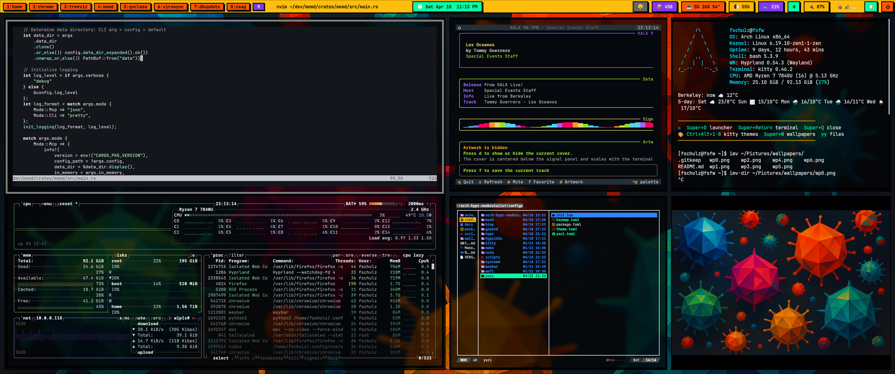

# arch-hyprland-neobrutalist

`v0.1.0` public baseline for a reproducible Arch Linux Hyprland setup with a neo-brutalist visual system.

This repo contains all the dotfiles necessary to set up the neo-brutalist Hyprland desktop: tracked configs, package manifests, install/apply scripts, screenshots space, and a small docs layer that explains the design choices instead of leaving them implicit.



## Included Components

- Hyprland desktop stack: `hyprland`, `hyprlock`, `hypridle`, `hyprsunset`, Waybar, Mako, Wofi
- Modular Hyprland config: `hyprland.conf` sources `conf.d/10-env … 70-windowrules`
- Neo-brutalist Waybar: Nerd Font iconography, white module fields with accent-colored
  state, submap/mode indicator, and a clock that opens a calendar popup
- Shell and terminal workflow: Bash, Kitty, Yazi, Neovim, fzf/zoxide/atuin/starship
- Login and lock experience: themed `greetd` + `regreet`, lock screen, wallpapers
- Desktop behavior: workspace rename flow, monitor helpers, power/network/USB scripts,
  screenshots (`grimblast`) and area screen recording (`wf-recorder`), and a `Super+/` cheatsheet
- Music: `Super+Shift+M` opens [bester-ytm](https://github.com/fmschulz/bester-ytm), a YouTube Music TUI installed as a `uv` tool by `make apply`

## Quick Start

Start from a working Arch install with a normal user that has `sudo` access:

```bash
sudo pacman -S --needed git make
git clone https://github.com/<owner>/arch-hyprland-neobrutalist.git
cd arch-hyprland-neobrutalist
make install
```

If you also want the themed `greetd` / `regreet` login manager:

```bash
make full-install
```

## Targets

```bash
make install
make full-install
make packages
make apply
make doctor
make system
make greetd
```

## Reproducibility Rules

- Repo-managed files are merged into `~/.config`; local state is preserved on `make apply`.
- The Hyprland config is modular. Edit a numbered section in
  `~/.config/hypr/conf.d/` rather than the `hyprland.conf` entry file.
- Monitor layout is intentionally local.
  Edit `~/.config/hypr/monitors.conf` (installed once from the tracked `.example`)
  instead of the tracked config; it is preserved across every `make apply`.
- Stateful or private data is intentionally excluded from git.
  This includes Bluetooth MAC addresses, workspace rename state, shell-local overrides, and any personal station additions.
- Yazi plugins and flavors are restored with `ya pkg install` during `make apply`.

## Docs

Full documentation - install tutorial, how-to guides, reference, and design explanation -
lives at <https://fmschulz.github.io/arch-hyprland-neobrutalist/>. It is built from `docs/`
with MkDocs (Material) and deployed by the `docs` workflow on push to `main`.

Preview locally:

```bash
uvx --with mkdocs-material mkdocs serve
```

Quick links into the tree:

- `docs/tutorials/getting-started.md` - install walkthrough
- `docs/reference/keybinds.md` - core desktop shortcuts
- `docs/explanation/design.md` - palette, typography, and local override boundaries
- `assets/screenshots/README.md` - checklist for the visual showcase captures

## Repo Layout

```text
configs/     Desktop, shell, and app configs copied into ~/.config
docs/        MkDocs documentation site (tutorials, how-to, reference, explanation)
packages/    Pacman and AUR package manifests
scripts/     Bootstrap, apply, doctor, and system setup scripts
wallpapers/  Neo-brutalist wallpaper set used by the desktop and lock screen
```

## Local Overrides

These files are meant to stay machine-local:

- `~/.config/arch-hypr-neobrutalist/bluetooth-devices.conf`
- `~/.config/arch-hypr-neobrutalist/welcome.conf` (weather location for the welcome banner)
- `~/.config/hypr/monitors.conf`
- `~/.bashrc.local`
